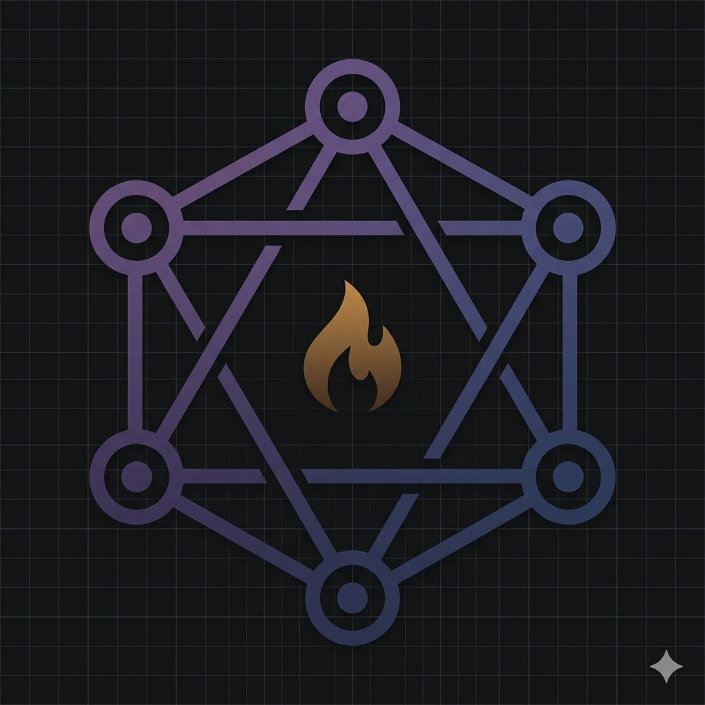

# Branding generation prompts — Activist OS

Generated with Gemini ("Create image" tool) on 2026-06-12.
Conversation: https://gemini.google.com/app/1bf0809c8283de20

## Logo (`activist-os-logo-v1.png`, 1024x559)

> A modern, serious, minimalist vector logo for "Activist OS" — an operating
> system for safe, evidence-backed civic advocacy, built for emerging
> grassroots organizations that manage public resources with full evidence
> trails. Dark-themed, sophisticated, technical — regulated-infrastructure
> feeling, not playful.
>
> THE EMBLEM: a central high-tech network node diagram — six interconnected
> nodes (a band of AI agents talking to each other) drawn as precise thin
> lines and dots with a dark-purple-to-deep-blue gradient. At the heart of
> the network, one small, subtle flame in a deep amber gradient — the core
> passion of activism, governed and contained by the structure around it.
> Clean geometry, sharp edges, perfectly balanced.
>
> THE WORDMARK: below the emblem, the words "ACTIVIST OS" in a strong,
> clean, modern grotesque sans-serif (like Inter or Space Grotesk), letters
> in a subtle purple-to-blue gradient, wide letter-spacing.
>
> THE TAGLINE: below the wordmark, in a smaller light-gray sans-serif:
> "Evidence. Coordination. Safety." separated by small dots.
>
> BACKGROUND: deep charcoal-black, with an extremely subtle darker-gray
> square grid pattern overlaid, like an engineering blueprint at night.
>
> FINISH: flat vector style, centered composition, sharp edges, palette of
> deep purples, dark blues, charcoal, and one hint of warm amber. The
> feeling: organized intelligence, audit-grade seriousness, focused energy.
> No clip-art, no fists, no megaphones, no clichés.

## App icon (`activist-os-icon-v1.png`, 1024x1024)

> Now create a second version: a perfectly square 1:1 app icon using ONLY
> the emblem — the hexagonal six-node network with the amber flame at its
> center — no wordmark, no tagline, no text at all. Keep the exact same
> style as the logo you just made: dark charcoal background with the subtle
> grid, purple-to-blue gradient lines and nodes, amber flame. The emblem
> fills most of the frame, centered, with comfortable padding. This will be
> used as a favicon and app avatar.

## Derived collection

Run `python3 web/branding/derive.py` (Pillow) to regenerate everything below
from the two masters. Masters are never overwritten.

| Asset | Size | Use |
|---|---|---|
| `favicon.ico` | 16+32+48 multi-res | browser tab |
| `apple-touch-icon.png` | 180×180 | iOS home screen |
| `icon-192.png` / `icon-512.png` | 192/512 | PWA manifest |
| `logo-full.png` / `emblem.png` | as generated | general use |
| `logo-white.png` | 1024×559 | white-on-transparent, for dark surfaces |
| `og-image.png` | 1200×630 | OpenGraph share card |
| `twitter-card.png` | 1200×600 | Twitter/X card |
| `linkedin-banner.png` | 1584×396 | LinkedIn page banner |
| `bg-hero-1920.png` / `bg-hero-3440.png` | 1920×1080 / 3440×1440 | hero backgrounds, "render entre sombras" treatment |

CSS-only equivalent of the background treatment (rancho-studio pattern), for
when the page should compose it client-side over `emblem.png` instead of
using the baked PNGs:

```html
<div aria-hidden class="absolute inset-0">
  
  <div class="absolute inset-0 bg-gradient-to-r from-zinc-950 via-zinc-950/10 to-zinc-950"></div>
  <div class="absolute inset-0 bg-gradient-to-b from-zinc-950/80 via-zinc-950/40 to-zinc-950/90"></div>
</div>
```

## Design notes

- Six nodes = the six agents (evidence, campaign, safety, outreach,
  coordinator, reporter); the connecting lines are Band coordination.
- The amber flame is the cause; the geometric structure containing it is
  the governance — the product thesis in one mark.
- Tagline maps to the three-line pitch: evidence (FI provenance),
  coordination (Band), safety (the veto gate).
- Palette: charcoal `#1a1a1e`-ish background, purple→blue gradient strokes,
  single amber accent. Keep any future assets on this palette.
